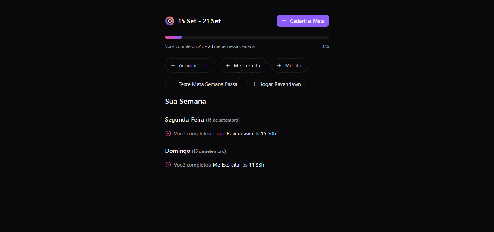
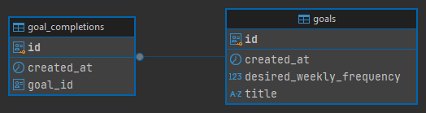
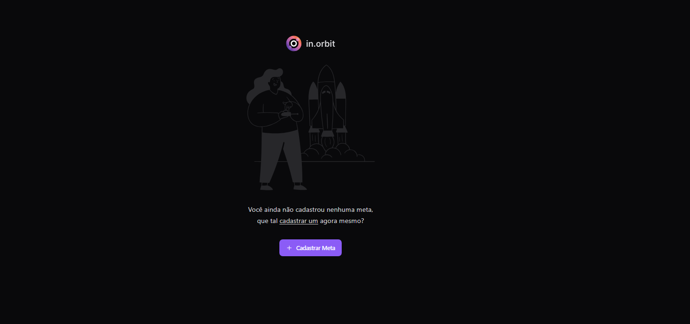

<h1 align="center"> NLW Pocket </h1>

Evento exclusivo e gratuito, promovido pela Rocketseat para ensino de tecnologias Front-end, Back-end.

  

  

## 🚀 Tecnologias

Esse projeto foi desenvolvido com as seguintes tecnologias:

- Web
  - React
  - Tailwindcss
  - Typescript
  - Lucide-react
  - dayjs
  - radix-ui
  - react-query
  - zod
  - react-hook-form
- Back-end
  - Java 17
  - Spring Boot Framework
  - Spring Validation
  - Database with Postgres
  - Migrations with Flyway

## 💻 Projeto

> Objetivo é criar um gerenciador de metas, onde o usuário cadastra metas semanais e pode controlar em tempo real.
   

## 🖼 ERD Driagrama

  

## 🖼 ScreenShot Web

  
  
  

## ✍ Licença

Esse projeto está sob a licença MIT.
